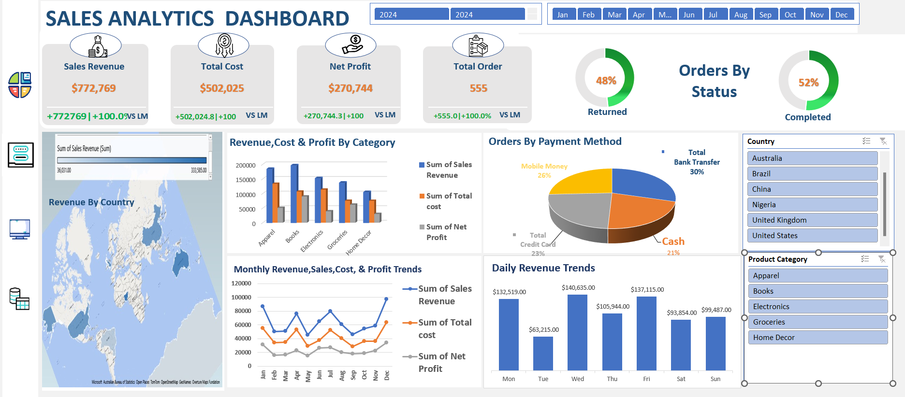

# Sales Performance & Operational Risk Analysis

## 📊 Project Overview
This project analyzes sales data to identify key revenue drivers, evaluate profitability, and uncover critical operational issues affecting business performance.

A major focus of this analysis is the unusually high product return rate, which poses a significant risk to profitability.

---

## 🎯 Business Problem
The business needs to:
- Understand what drives revenue and profit
- Identify operational inefficiencies
- Reduce high product return rates
- Optimize performance across regions, categories, and time periods

---

## 🛠️ Tools Used
- Excel
- Power Query
- Pivot Tables

---
## 📊 Dashboard Preview

## 🔍 Key Insights

### 💰 Financial Performance
- Revenue: $772,769  
- Profit: $270,744  
- Profit Margin: ~35%  

👉 The business is profitable, with efficient cost management.

---

### ⚠️ Critical Issue: High Return Rate
- 48% of all orders are returned  

👉 This is a severe operational problem that directly impacts profitability.

---

### 🌍 Revenue Distribution
- Top markets: United States, China, Australia  
👉 Revenue is highly concentrated in a few regions

---

### 📦 Category Performance
- Top performers: Apparel, Electronics  
- Weak category: Home Décor  

👉 Some categories generate revenue but may require cost optimization

---

### 💳 Payment Behavior
- Bank Transfer: 30%  
- Mobile Money: 26%  
- Credit Card: 23%  
- Cash: 21%  

👉 Customers use diverse payment methods—no single dominant channel

---

### 📅 Seasonal Trends
- Peak months: January, March, August, December  

👉 Strong seasonality affects revenue performance

---

### 📆 Daily Performance
- Best days: Monday, Wednesday, Friday  
- Weak day: Saturday  

👉 Sales activity varies significantly by day of the week

---

## 📈 Business Recommendations

### 1. Reduce Return Rate (Top Priority)
- Investigate root causes:
  - Product quality
  - Delivery issues
  - Customer expectations
- Segment returns by category, region, and payment type

---

### 2. Optimize Product Strategy
- Invest more in Apparel and Electronics  
- Reevaluate Home Décor performance  

---

### 3. Expand High-Performing Markets
- Focus growth efforts on USA, China, Australia  
- Develop strategies for underperforming regions  

---

### 4. Manage Seasonality
- Increase promotions during low-performing months  
- Use peak months for aggressive sales campaigns  

---

### 5. Improve Payment Strategy
- Maintain flexibility across payment options  
- Encourage cost-efficient payment methods  

---

### 6. Optimize Weekly Sales Performance
- Run promotions on high-performing days  
- Improve engagement on low-performing days  

---

## 💼 Business Value
This analysis demonstrates how data can be used to:
- Identify revenue opportunities  
- Detect operational risks  
- Improve customer retention  
- Support data-driven decision-making  

---

## 🚀 Application
This approach can be applied to real business data to uncover hidden issues, improve profitability, and guide strategic decisions.
